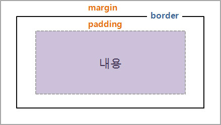

# 📕 Margin과 Padding의 차이점

# 📕 웹 페이지 요소

웹 페이지에 요소를 삽입하면 다음과 같은 구성을 가진다.

제일 내부에 실제로 우리가 보게되는 콘텐츠가 있고, 그 밖을 `패딩`,

`패딩`의 겉은 `테두리`가 둘러싸고 있다.

그리고 테두리와 다른 요소의 공백은 `마진`영역이라고 한다.

> 내부 여백은 `패딩`
> 외부 여백은 `마진`

 

# 📖 마진의 요소

-   margin: 사방의 마진 영역을 조절합니다.
-   margin-top: 상단 마진 영역을 조절합니다.
-   margin-bottom: 하단 마진 영역을 조절합니다.
-   margin-right: 우측 마진 영역을 조절합니다.
-   margin-left: 좌측 마진 영역을 조절합니다.

특정 위치 마진을 조정하고 싶다면 방향을 지정하고, 4 방면을 모두 조정하고 싶다면 margin만 사용

 

마진에 대한 속성값은 값, 백분율, auto가 있다.

-   값: 단위(px 등)으로 직접 지정
-   백분율: 부모 요소 기준으로 백분율 지정
-   auto: 브라우저, 요소의 크기에 따라 적정값으로 마진을 자동 조절

 

# 📖 패딩의 요소

-   padding: 사방의 패딩 영역을 조절합니다.
-   padding-top: 상단 패딩 영역을 조절합니다.
-   padding-bottom: 하단 패딩 영역을 조절합니다.
-   padding-right: 우측 패딩 영역을 조절합니다.
-   padding-left: 좌측 패딩 영역을 조절합니다.
