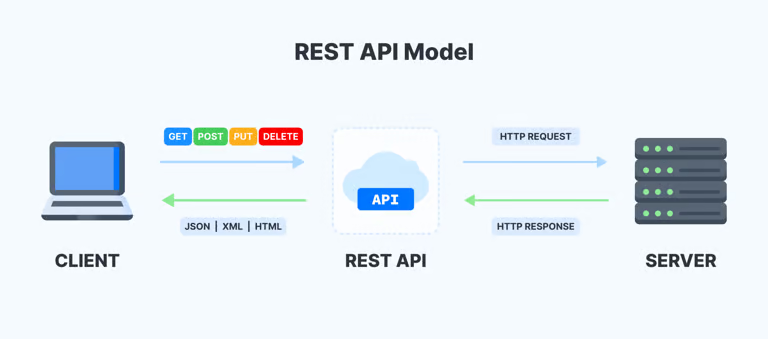
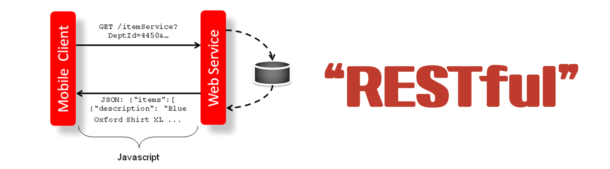

# 📚 REST

## 📕 REST란?

> 자원을 이름으로 구분하여 해당 `자원의 상태`를 `주고받는 모든 것`
>
> -   `HTTP라는 프로토콜`을 이용하여 Web에서 제공하는 모든 자원을 가리킬 수 있는 `고유한 주소(URI)`를 이용해서 `HTTP Method`를 통해 `작업(CRUD)을 처리`하는 방식

자원(resource)의 표현(representation)에 의한 상태 전달

1. 자원(resource)의 표현(representation)

    - 자원: 해당 소프트웨어가 관리하는 모든 것  
      ex) 문서, 그림, 데이터, 해당 소프트웨어 자체 등
    - 자원의 표현: 그 자원을 표현하기 위한 이름  
      ex) DB의 학생 정보가 자원일 때, ‘students’를 자원의 표현으로 정함.

2. 상태(정보) 전달
    - 데이터가 요청되어지는 시점에서 자원의 상태(정보)를 전달.
    - `JSON` 혹은 `XML`를 통해 데이터를 주고 받는 것이 일반적.

 

---

## 📕 REST의 개념

> `HTTP URI`를 통해 자원(resource)을 명시하고, `HTTP Method`(POST, GET, PUT, DELETE)를 통해 해당 자원에 대한 CRUD Operation을 적용하는 것을 의미

-   웹 사이트의 이미지, 텍스트, DB 내용 등의 `모든 자원`에 고유한 ID인 `HTTP URI`를 부여
-   CRUD Operation
    -   Create : 생성(POST)
    -   Read : 조회(GET)
    -   Update : 수정(PUT)
    -   Delete : 삭제(DELETE)
    -   HEAD: header 정보 조회(HEAD)

 

---

## 📕 REST의 장단점

### 📖 장점

-   HTTP 프로토콜의 인프라를 그대로 사용하므로 REST API 사용을 위한 `별도의 인프라`를 `구축할 필요가 없다`.
-   HTTP 표준 프로토콜에 따르는 `모든 플랫폼`에서 `사용 가능`.
-   REST API 메시지가 의도하는 바를 명확하게 나타내므로 `의도를 쉽게 파악`할 수 있다.
-   서버와 클라이언트의 `역할을 명확하게 분리`

 

### 📖 단점

-   표준이 존재하지 않음
-   사용할 수 있는 메소드가 4가지 밖에 없다.

 

---

 

# 📚 REST API

## 📕 REST API란?

> REST 기반으로 서비스를 `API`를 구현한 것, OpenAPI는 대부분 REST API를 제공

-   API(Application Program Interface)란?
    -   데이터와 기능의 집합을 제공하여 컴퓨터 프로그램간 상호작용을 촉진, `정보 교환 가능하도록` 하는 것

 

---

## 📕 REST API 특징

-   사내 시스템들도 REST 기반으로 `시스템을 분산`해 `확장성`과 `재사용성`을 높여 `유지보수 및 운용을 편리`하게 할 수 있다.
-   REST는 HTTP 표준을 기반으로 구현하므로, HTTP를 지원하는 프로그램 언어로 클라이언트, 서버를 구현할 수 있다.
-   즉, REST API를 제작하면 델파이 클라이언트 뿐 아니라, 자바, C#, 웹 등을 이용해 클라이언트를 제작할 수 있다.

 

---

 

# 📚 RESTful

## 📕 RESTful이란?

> REST라는 아키텍처를 구현하는 웹 서비스를 나타내기 위해 사용되는 용어

-   RESTful은 REST를 REST답게 쓰기 위한 방법으로, 누군가가 공식적으로 발표한 것이 아니다.
    즉, REST 원리를 따르는 시스템은 RESTful이란 용어로 지칭

 

---

## 📕 RESTful의 목적

-   이해하기 쉽고 사용하기 쉬운 REST API를 만드는 것
-   RESTful한 API를 구현하는 근본적인 목적이 성능 향상에 있는 것이 아니라 일관적인 컨벤션을 통한 API의 이해도 및 호환성을 높이는 것이 주 동기이니, 성능이 중요한 상황에서는 굳이 RESTful한 API를 구현할 필요는 없다.

 

---

## 📕 RESTful 하지 못한 경우

-   Ex1) CRUD 기능을 모두 POST로만 처리하는 API
-   Ex2) route에 resource, id 외의 정보가 들어가는 경우(/students/updateName)

 

---

 

# 📚 참조

> https://appmaster.io/ko/blog/rest-apiran-mueosimyeo-dareun-yuhyeonggwa-eoddeohge-dareungayo  
> https://gmlwjd9405.github.io/2018/09/21/rest-and-restful.html > https://sidepower.tistory.com/408
