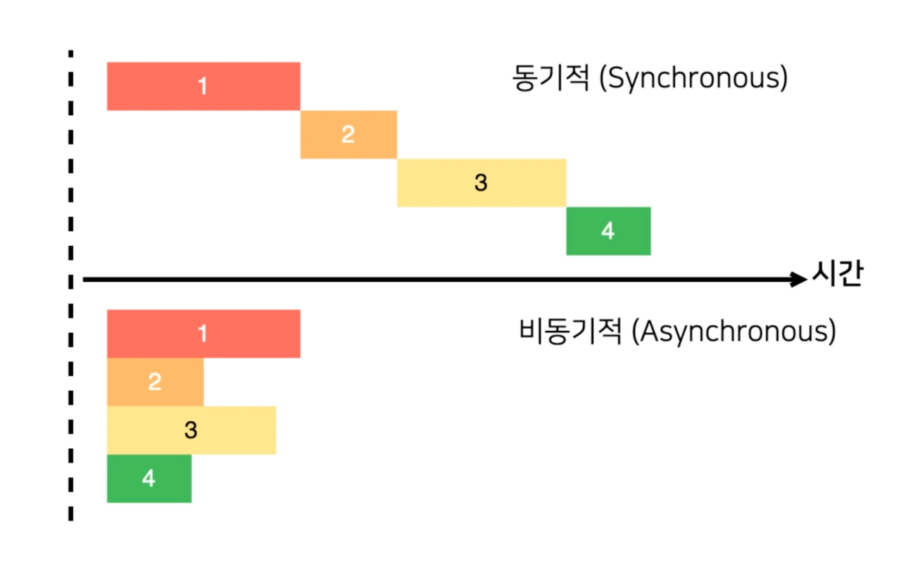
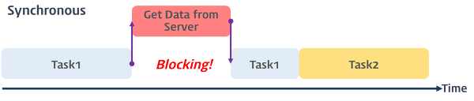
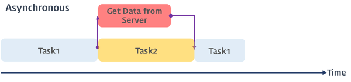
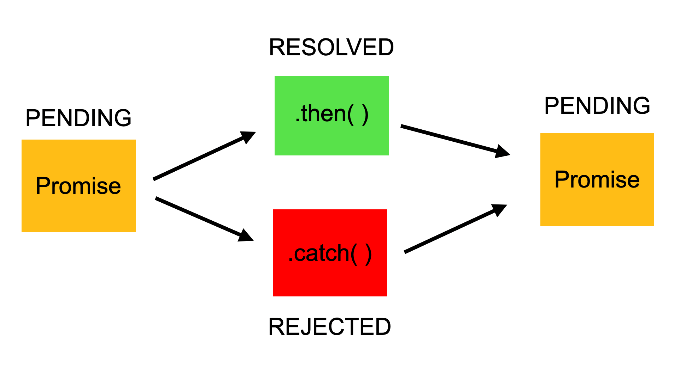

# 📚 비동기 처리란?

# 📕 동기처리

> 먼저 시작된 하나의 작업이 끝날 때 까지 다른 작업을 시작하지 않고 기다렸다가 다 끝나면 새로운 작업을 시작하는 방식

<br/>

# 📕 비동기 처리

> 먼저 실행된 작업이 끝날 때까지 기다리지 않고 다음 작업을 수행하는 방식



<br/>

# 📕 비동기가 나온 배경

자바스크립트의 특징 중 하나는 `단일 스레드`로 동작한다.

단일 스레드란? `한번에 하나의 일을 처리하는 것`

이러한 특징으로 오래 걸리는 작업이 있으면 그 작업을 하느라, 다른 작업들은 그만큼 기다려야 한다는 단점이 발생하였다.



이를 해결하기 위해 나온 개념이 `비동기 처리`

특정 코드의 연산이 끝날 때까지 코드의 실행을 멈추지 않고 다음 코드를 먼저 실행하는 것



<br/>

# 📕 자바스크립트 비동기 내장함수

자바스크립ㅌ크는 비동기 내장 함수를 제공하는데, 그것은 바로 `setTimeout`, `XMLHttpRequest`, `fetch()`이다.

XMLHttpRequest는 현재는 잘 사용하지 않는 것으로 현재는 fetch를 많이 사용한다.

fetch는 Promise 기반이기 때문에 Promise 이후에 살펴보겠다.

따라서 여기선 setTimeout에 대해서만 간단하게 보도록 하자.

<br/>

## 📖 setTimeout()

> 일정 시간이 지난 후에 함수를 실행

```js
// setTimeout(function() { 코드 or 콜백함수 }, 지연시간);

setTimeout(() => console.log("2초 후 실행"), 2000);
```

setTimeout을 통해 2초 이후에 실행된다.

clearTimeout() 함수는 setTimeout()을 취소, 중지시킨다.

하지만 콜백 함수로써 비동기를 처리하는 방법은 중첩으로 콜백 함수를 실행할 경우, 가독성이 떨어진다.(콜백 지옥) 따라서 이를 해결하기 위해 Promise가 생겼다.

## 📖 Promise

> `Promise`는 자바스크립트에서 제공하는 비동기를 간편하게 처리할 수 있도록 도와주는 객체이다.

3가지 상태를 가진다

-   Pending(대기)
-   Resolved(이행)
-   Rejected(거부)

    .then promise 가 종료가 되면 resolved 에 들어간 값을 받을 수 있다.



만약 콜백 함수로 1초 뒤에 10을 더하는 함수를 작성하면 다음과 같이 콜백 지옥에 빠진다

```js
increase(result, result=>{
  console.log(result);
  increase(result, result=>{
    console.log(result);
(...)
```

하지만, Promise를 사용하면 다음과 같이 가독성이 좋아진다.

```js
.then(number=>{
  console.log(number);
  return increase(number);
})
.then(number=>{
  console.log(number);
  return increase(number);
})
.catch(e=>{
  console.log(e);
});
```

## 📖 async/await

`async` 를 붙이면 해당 함수는 항상 Promise를 반환한다.
`await` 키워드를 만나면 Promise가 처리(settled)될 때까지 대기한다. 결과는 그 이후 반환한다.
`.catch` rejected 된 경우, catch를 사용해 에러를 잡아줄 수 있다.

```js
async function run(){
  try{
    let result = await increase(0);
    console.log(result);
    result = await increase(result);
    console.log(result);
    result = await increase(result);
    console.log(result);
  } catch(e){
    console.log(e);
}
```

# 📕 참조

> https://velog.io/@wkahd01/%EB%B9%84%EB%8F%99%EA%B8%B0-%EC%B2%98%EB%A6%AC  
> https://velog.io/@hayyim0626/TIL-Promise  
> https://velog.io/@kim_unknown_/JavaScript-Asynchronous#3-promise
