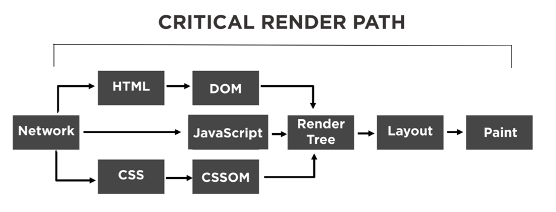
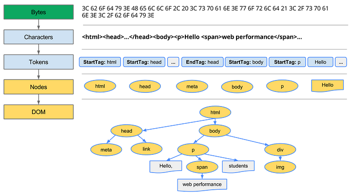
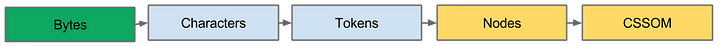
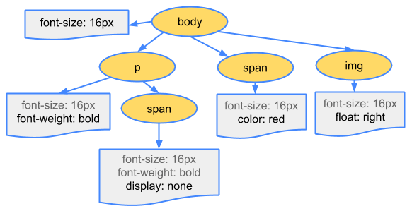
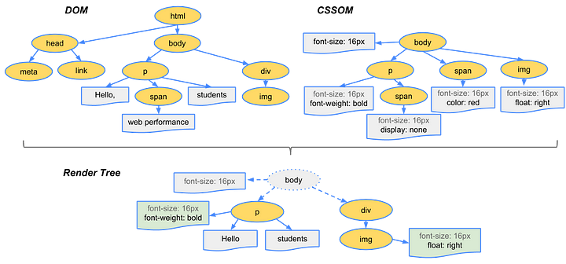

# 📕 브라우저란?

> 웹 서버에서 이동하며 쌍방향으로 통신하고 HTML 문서나 파일을 출력하는 그래픽 사용자 인터페이스 기반의 응용 소프트웨어이다.  
> -위키백화 -

 

# 📕 브라우저 렌더링 과정

## 1. 주소창에 입력된 주소를 통해 서버를 찾아간다.

 

## 2. 이후 DNS가 연결해줄 곳을 찾는다.

 

## 3. 서버에서 HTML 파일을 클라이언트로 보낸다.

 

## 4. HTML 문서는 파싱되어 DOM을 생성한다.

 

### 📖 1. 변환 : 브라우저가 HTML의 원시 바이트를 읽어와서, HTML에 정의된 인코딩(예: UTF-8)에 따라 개별 문자로 변환

 

### 📖 2. 토큰화 : 브라우저가 문자열을 W3C 표준에 지정된 고유 토큰으로 변환

 

### 📖 3. 렉싱 : 방출된 토큰은 해당 속성 및 규칙을 정의하는 “객체”로 변환

 

### 📖 4. DOM 생성 : 마지막으로 HTML 마크업에 정의된 여러 태그 간의 관계를 해석해서 트리 구조로 연결

 

브라우저는 HTML 마크업을 처리 할 때 마다 위의 모든 단계를 수행
 

## 5. 중간에 CSS를 로드하는 link혹은 style 태그를 만나면 DOM 생성을 중지한다.

 

## 6. CSS를 파싱하고 CSSOM을 생성한다.

HTML 마크업 내에 직접(inline) 스타일을 선언할 수도 있지만, head 태그에 외부(external) css 파일을 참조하거나, head 태그에 style 태그(internal)를 정의할 수 있습니다. HTML과 마찬가지로 외부(external) css 파일에 정의된 스타일과 style 태그에 작성된 스타일을 브라우저가 이해하고 처리할 수 있는 형식으로 변환해야 합니다.

DOM 트리를 생성하는 과정과 동일한 과정으로 CSSOM 트리를 생성합니다.

위와 같은 과정을 거쳐서 마지막으로 CSSOM(CSS Object Model)이라는 트리 구조가 생성

 

## 7. 이렇게 만들어진 DOM와 CSSOM은 렌더링(브라우저에 시각적으로 출력하는 것)을 위해 렌더 트리로 결합된다.

DOM 트리와 CSSOM 트리가 만들어지면, 이 둘을 결합해서 렌더링 트리를 생성합니다. 렌더링 트리에는 페이지를 렌더링 하는데 필요한 노드만 포함됩니다.

 

## 8. 만약 script 태그를 만나면, css와 동일하게 JS코드를 실행하기 위해 파싱을 중단한다.

 

## 9. 이후 JS엔진을 실행하고 JS코드를 파싱한다.
